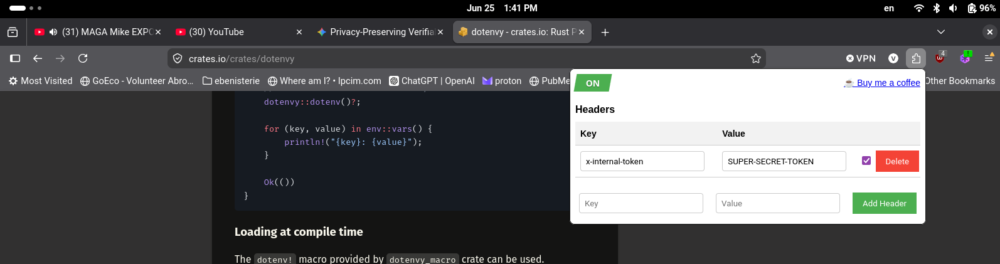

# Securite 
### TOKEN
Pour communiquer avec l'api iun token interne est nécessaire. 
Le token nécessaire est : x-internal-token
La valeur est configurer dans le fichier **.env** 
Le plugin "Headers" de firefox permet de faire des appels facilement
 

---
# APACHEBENCH (ab)
Pour faire un stress test, utiliser Apache bench, la commande suivant envoie 100 000 requete via 100 worker different (conccurrent).
C'est pratique pour voir comment l'api handle le traffique. 
>ab -n 100000 -H "x-internal-token: SUPER-SECRET-TOKEN" -c 100 -p payload_post_encrypte.json -T application/json 127.0.0.1:3000/hello

Pour rouler les fichier .http, on peut utiliser intellijhttp(ijhttp) soit via l<interface graphique 
ou via la ligne de commande. Difficile de faire de la grosse concurrence (stress test) car le server netty 
utilisé par ijhttp plante. APACHEBENCH est mieux pour ce travail
> ojhttp get_hello.http